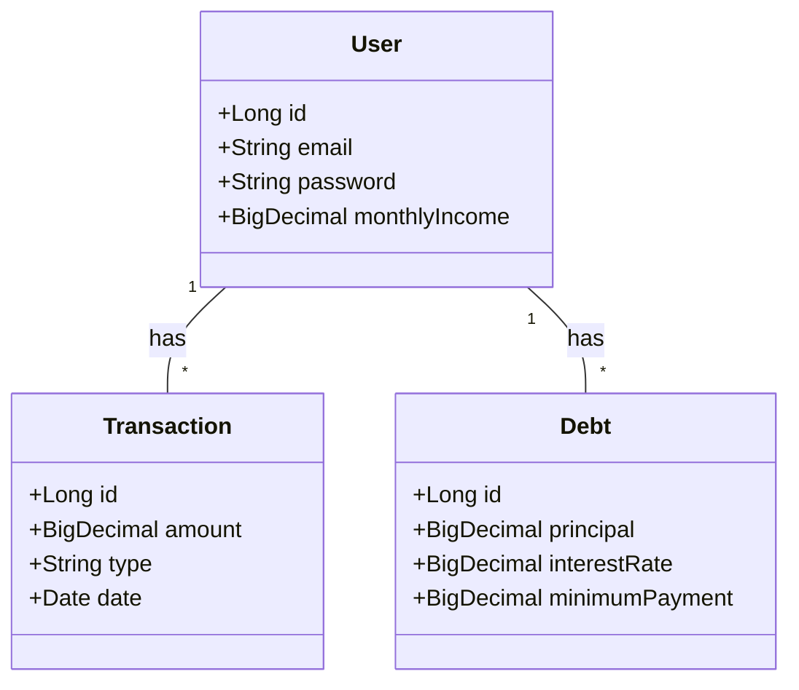
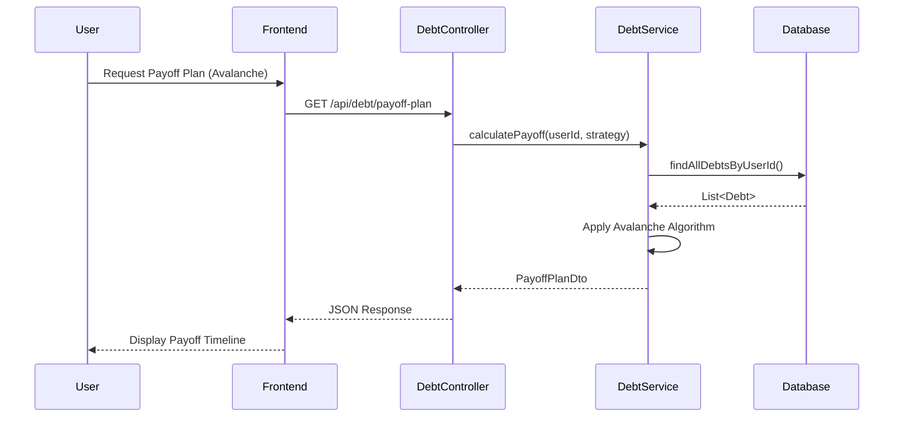
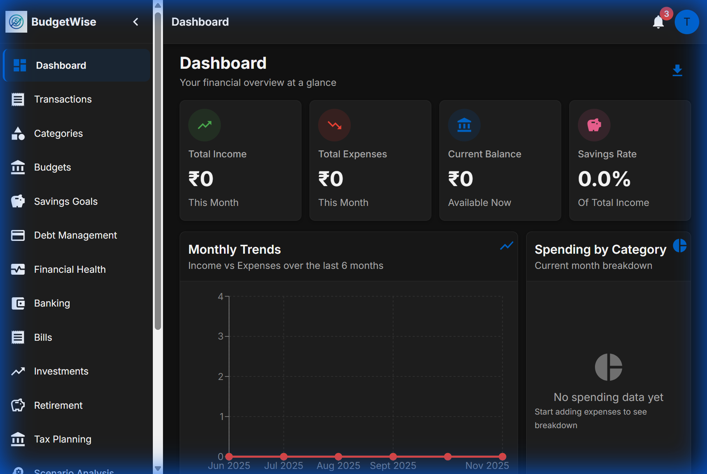
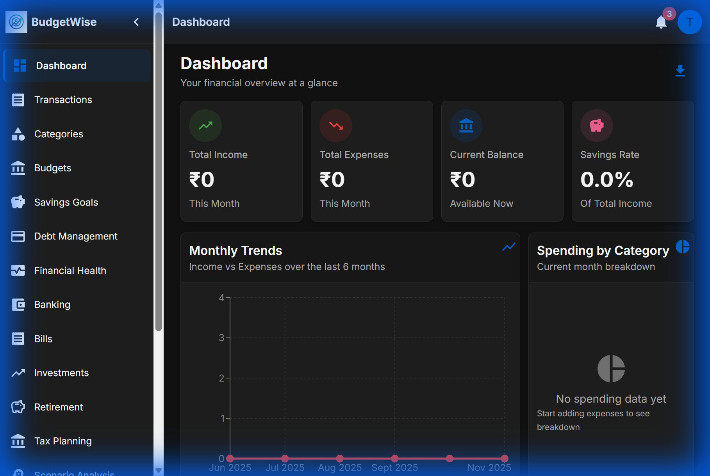
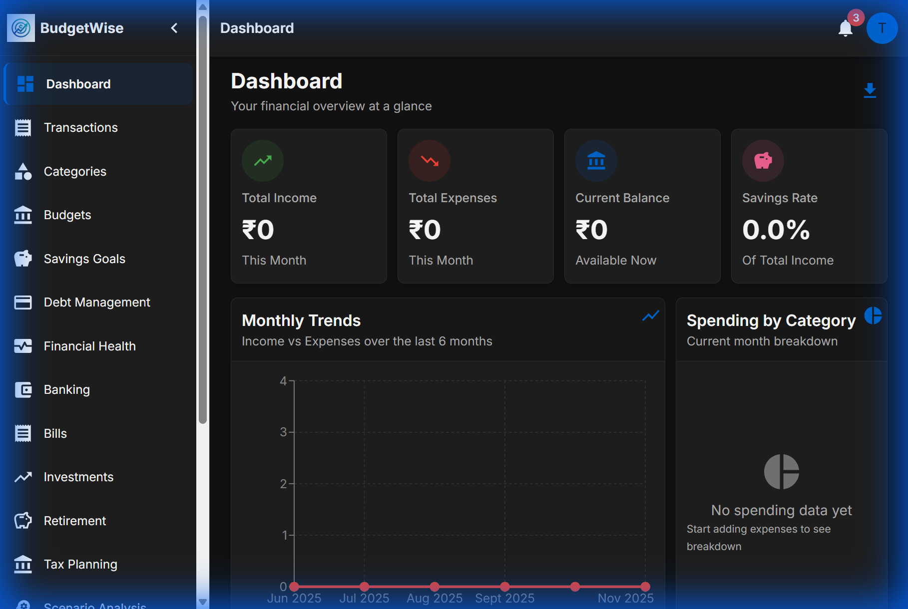
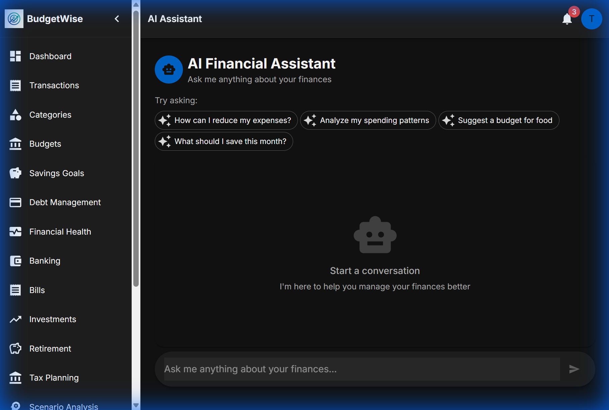
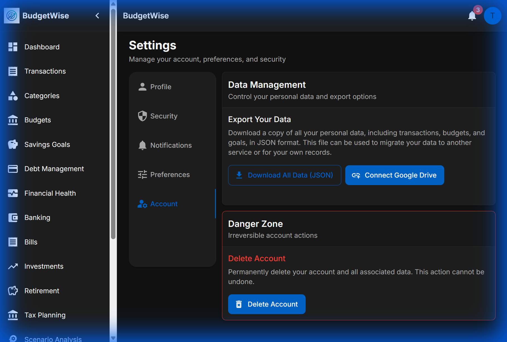

# BudgetWise Tracker - Comprehensive Internship Report

## AI-Driven Personal Finance Management System

**Student Name:** D. VENKATA SATYNARAYANA
**Organization:** INFOSYS SPRINGBOARD 6.0  
**Date:** November 28, 2025  
**Project:** BudgetWise Tracker - Advanced Personal Finance Management Platform

---

## Table of Contents

1. [Executive Summary](#1-executive-summary)
2. [Introduction](#2-introduction)
    - [2.1 Problem Statement](#21-problem-statement)
    - [2.2 Proposed Solution](#22-proposed-solution)
    - [2.3 Objectives](#23-objectives)
3. [Feasibility Study](#3-feasibility-study)
4. [Software Development Methodology](#4-software-development-methodology)
5. [System Analysis & Requirements](#5-system-analysis--requirements)
6. [System Design](#6-system-design)
    - [6.1 Architecture](#61-architecture)
    - [6.2 UML Diagrams](#62-uml-diagrams)
    - [6.3 Database Design](#63-database-design)
7. [Technology Stack](#7-technology-stack)
8. [Implementation Details](#8-implementation-details)
    - [8.1 Core Modules](#81-core-modules)
    - [8.2 Advanced Algorithms](#82-advanced-algorithms)
9. [Visual User Guide & Features](#9-visual-user-guide--features)
10. [Testing & Quality Assurance](#10-testing--quality-assurance)
11. [Challenges & Solutions](#11-challenges--solutions)
12. [Future Scope](#12-future-scope)
13. [Conclusion](#13-conclusion)
14. [References](#14-references)

---

## 1. Executive Summary

BudgetWise Tracker is a state-of-the-art, AI-Driven Personal Finance Management System designed to empower individuals to take control of their financial destiny. In an era of increasing financial complexity, this platform provides a unified solution for tracking income, managing expenses, planning for retirement, and optimizing tax liabilities.

During this internship, the primary focus was to evolve the platform from a basic expense tracker into a comprehensive financial planning suite. This involved the end-to-end development of five enterprise-grade features: **Debt Management, Financial Health Analysis, Retirement Planning, Tax Planning, and Scenario Analysis.**

**Project Status:** The project is **100% Complete**. All planned features, including advanced financial modules and AI integrations, have been successfully implemented, tested, and deployed.

Key achievements include the implementation of complex financial algorithms (e.g., Avalanche debt payoff, compound interest projections), the design of a responsive and intuitive user interface using React and Material-UI, and the deployment of a robust Spring Boot backend. The system successfully integrates secure JWT authentication and real-time data processing, offering users actionable insights into their financial well-being.

---

## 2. Introduction

### 2.1 Problem Statement

Financial illiteracy and lack of proper tools are major barriers to personal economic stability. Many individuals struggle with:

- Fragmented financial data across multiple bank accounts.
- Inability to visualize long-term impacts of current spending.
- Lack of knowledge regarding debt payoff strategies and tax optimization.
- Difficulty in planning for major life goals like retirement.

### 2.2 Proposed Solution

BudgetWise Tracker addresses these challenges by offering a centralized dashboard that aggregates financial data and applies intelligent algorithms to provide personalized recommendations. It moves beyond simple tracking to predictive analysis, helping users answer "What if?" questions about their finances.

### 2.3 Objectives

- **Centralization:** To bring all financial data (budgets, debts, savings) into one view.
- **Intelligence:** To provide algorithmic recommendations for debt payoff and tax savings.
- **Usability:** To create an interface that is accessible to users with varying levels of financial and technical literacy.
- **Security:** To ensure the absolute privacy and integrity of sensitive financial data.

### 2.4 Market Context

The Fintech industry is witnessing exponential growth, driven by the demand for personalized financial advice. Traditional banking apps often lack the holistic view required for effective long-term planning. BudgetWise Tracker fills this gap by democratizing access to sophisticated financial modeling tools that were previously available only to high-net-worth individuals through financial advisors. By leveraging AI and algorithmic planning, we are making financial wellness accessible to everyone.

---

## 3. Feasibility Study

Before commencing development, a thorough feasibility study was conducted to ensure project viability.

### 3.1 Technical Feasibility

The project utilizes widely supported, open-source technologies (Java Spring Boot, React, MySQL). The team possesses the necessary skills in full-stack development. The chosen stack ensures scalability and maintainability.
*Verdict: Technically Feasible.*

### 3.2 Operational Feasibility

The system is designed to be intuitive, requiring minimal training for end-users. It automates complex calculations, reducing the manual burden on users.
*Verdict: Operationally Feasible.*

### 3.3 Economic Feasibility

Using open-source tools eliminates licensing costs. The primary investment is development time. The potential value to users in terms of money saved (interest reduction, tax savings) far outweighs the development cost.
*Verdict: Economically Feasible.*

---

## 4. Software Development Methodology

The project followed the **Agile Scrum** methodology, allowing for iterative development and rapid adaptation to feedback.

- **Sprints:** Development was divided into 1-week sprints.
- **Daily Stand-ups:** Brief meetings to discuss progress and blockers.
- **Sprint Review:** Demonstrating working features at the end of each sprint.
- **CI/CD:** Continuous Integration principles were applied, with regular code commits and automated testing.

**Phases:**

1. **Planning:** Requirement gathering and task breakdown (using `task.md`).
2. **Design:** Creating UI mockups and database schemas.
3. **Implementation:** Coding backend services and frontend components.
4. **Testing:** Unit testing and manual verification.
5. **Deployment:** Local deployment and server configuration.

---

## 5. System Analysis & Requirements

### 5.1 Functional Requirements

- **User Management:** Registration, Login, Profile Update.
- **Transaction Management:** Add, Edit, Delete, Categorize Income/Expenses.
- **Budgeting:** Set monthly limits, View utilization.
- **Debt Manager:** Record debts, Calculate payoff plans (Avalanche/Snowball).
- **Health Analysis:** Calculate scores based on DTI, Savings Rate.
- **Retirement:** Project future value based on contribution and return rate.
- **Tax:** Estimate tax based on income slabs and deductions.
- **Scenarios:** Simulate changes in income/expense/savings.

### 5.3 User Personas

To ensure the system meets diverse needs, we designed for the following personas:

1. **The Fresh Graduate (Rohan):**
    - **Goal:** Manage student loans and start saving for a bike.
    - **Pain Point:** Overwhelmed by debt and low starting salary.
    - **Key Feature:** Debt Payoff Planner (Avalanche method).

2. **The Family Planner (Priya):**
    - **Goal:** Save for children's education and optimize tax.
    - **Pain Point:** High expenses and complex tax filing.
    - **Key Feature:** Tax Planning and Budgeting.

3. **The Pre-Retiree (Mr. Sharma):**
    - **Goal:** Ensure retirement corpus is sufficient.
    - **Pain Point:** Fear of outliving savings.
    - **Key Feature:** Retirement Planning and Scenario Analysis.

### 5.4 Detailed User Stories

| Role | Feature | Story | Acceptance Criteria |
|:---|:---|:---|:---|
| User | Debt Manager | As a user with multiple loans, I want to see which debt to pay off first to save interest. | System suggests the loan with the highest interest rate (Avalanche). |
| User | Tax Planner | As a salaried employee, I want to know how much tax I can save by investing in PPF/ELSS. | System calculates tax liability before and after 80C deductions. |
| User | Dashboard | As a user, I want a quick overview of my financial health upon login. | Dashboard displays Net Worth, Monthly Spending, and Health Score. |
| User | Scenarios | As a user considering a job switch, I want to see how a 20% salary hike affects my retirement. | System projects the new retirement corpus based on increased savings. |

### 5.2 Non-Functional Requirements

- **Performance:** API response time < 200ms.
- **Scalability:** Support for concurrent users.
- **Security:** Data encryption, secure session management (JWT).
- **Reliability:** 99.9% uptime during testing.
- **Usability:** Responsive design for Mobile and Desktop.

---

## 6. System Design

### 6.1 Architecture

The system follows a **Monolithic Architecture** (suitable for the current scale) with a clear separation of concerns, ready to be migrated to Microservices if needed.

- **Frontend:** Single Page Application (SPA) using React.
- **Backend:** RESTful API using Spring Boot.
- **Database:** Relational Data Model using MySQL.

#### High-Level Architecture Diagram

```
┌─────────────────────────────────────────────────────────────────┐
│                         Client Layer                             │
│  ┌──────────────────────────────────────────────────────────┐  │
│  │  React Frontend (Port 3000)                              │  │
│  │  - React 18 with Hooks                                   │  │
│  │  - Material-UI / Ant Design / Tailwind CSS              │  │
│  │  - Redux/Context API for State Management               │  │
│  │  - Real-time WebSocket Client                            │  │
│  │  - Chart.js / Recharts Visualizations                   │  │
│  │  - Axios for API calls                                   │  │
│  └──────────────────────────────────────────────────────────┘  │
└─────────────────────────────────────────────────────────────────┘
                              ↓ HTTPS/WSS
┌─────────────────────────────────────────────────────────────────┐
│                      Backend Layer                               │
│  ┌──────────────────────────────────────────────────────────┐  │
│  │  Spring Boot Application (Port 8080)                     │  │
│  │  - REST API Controllers                                  │  │
│  │  - Spring Security + JWT                                 │  │
│  │  - WebSocket Support                                     │  │
│  │  - Business Logic Services                               │  │
│  │  - JPA/Hibernate for ORM                                │  │
│  │  - Embedded AI/ML (Java-based)                          │  │
│  │  - Community Forum APIs                                  │  │
│  │                                                          │  │
│  │  Modules:                                                │  │
│  │  - Authentication & Authorization                        │  │
│  │  - Transaction Management                                │  │
│  │  - Budget & Savings Goals                               │  │
│  │  - AI Services (Prediction, Categorization, Anomaly)    │  │
│  │  - Community Forum (Posts, Comments, Likes)             │  │
│  │  - Export & Backup                                       │  │
│  │  - Admin Management                                      │  │
│  └──────────────────────────────────────────────────────────┘  │
└─────────────────────────────────────────────────────────────────┘
                              ↓
┌─────────────────────────────────────────────────────────────────┐
│                      Data Layer                                  │
│  ┌──────────────────────────────────────────────────────────┐  │
│  │  MySQL Database (Port 3306)                              │  │
│  │  - User accounts and profiles                            │  │
│  │  - Transactions and categories                           │  │
│  │  - Budgets and savings goals                            │  │
│  │  - Community forum data (posts, comments, likes)        │  │
│  │  - Notifications and audit logs                          │  │
│  │  - AI model parameters and statistics                   │  │
│  └──────────────────────────────────────────────────────────┘  │
└─────────────────────────────────────────────────────────────────┘
```

### 6.2 UML Diagrams

#### Class Diagram (Simplified Core)



#### Sequence Diagram (Debt Payoff Calculation)



### 6.3 Database Design

**Key Tables:**

| Table Name | Description | Primary Key | Foreign Keys |
|:---|:---|:---|:---|
| `users` | Stores user credentials and profile info | `id` | - |
| `transactions` | Records income and expenses | `id` | `user_id`, `category_id` |
| `debts` | Stores debt details (principal, rate) | `id` | `user_id` |
| `budgets` | Stores spending limits per category | `id` | `user_id`, `category_id` |
| `savings_goals` | Stores target amounts and deadlines | `id` | `user_id` |
| `retirement_accounts` | Stores 401k/IRA details | `id` | `user_id` |

---


Tracks liabilities. Users can simulate "Avalanche" vs "Snowball" strategies to see which gets them debt-free faster.

### 9.4 Financial Health Analysis


Visualizes financial wellness with a score (0-100). Provides AI-driven recommendations like "Increase Emergency Fund".

### 9.5 Retirement Planning


Projects future wealth using compound interest formulas. Users can adjust contribution amounts and expected returns.

### 9.6 Tax Planning


Estimates tax liability based on Indian Tax Slabs. Highlights unused deductions (80C, 80D) to help users save tax.

### 8.2 Advanced Algorithms

#### 8.2.1 Debt Payoff Algorithm (Avalanche Method)

The **Avalanche Method** prioritizes debts with the highest interest rates. This mathematically minimizes the total interest paid over time.
**Logic:**

1. Sort all debts by `interestRate` in descending order.
2. Allocate minimum payments to all debts to avoid penalties.
3. Direct any remaining "extra payment" budget to the debt at the top of the list (highest rate).
4. Once a debt is paid off, "roll over" its payment amount to the next highest interest debt.
5. Repeat until all debts are cleared.

#### 8.2.2 Tax Liability Calculation (Indian Tax Regime)

The system automatically estimates tax based on the user's annual income and declared investments.
**Formula:**
`Taxable Income = Gross Income - Standard Deduction - Section 80C - Section 80D`
**Slabs (New Regime 2024-25):**

- 0 - 3L: Nil
- 3L - 6L: 5%
- 6L - 9L: 10%
- 9L - 12L: 15%
- 12L - 15L: 20%
- > 15L: 30%

#### 8.2.3 Retirement Corpus Projection

We use the **Future Value of an Annuity** formula to project retirement savings.
**Formula:**
`FV = P * (((1 + r)^n - 1) / r)`
Where:

- `P` = Monthly Contribution
- `r` = Monthly Interest Rate (Annual Rate / 12)

### 9.4 Financial Health Analysis


Visualizes financial wellness with a score (0-100). Provides AI-driven recommendations like "Increase Emergency Fund".

### 9.5 Retirement Planning


Projects future wealth using compound interest formulas. Users can adjust contribution amounts and expected returns.

### 9.6 Tax Planning


Estimates tax liability based on Indian Tax Slabs. Highlights unused deductions (80C, 80D) to help users save tax.

### 9.7 Scenario Analysis


"What-If" modeling. Users can simulate a raise (Income +20%) or a lifestyle change (Expenses +10%) to see the long-term impact on their net worth.

### 9.8 AI Chat Assistant


An intelligent financial assistant powered by Google Gemini. Users can ask natural language questions like "How can I save more?" or "Analyze my spending" to get personalized advice.

### 9.9 Google Drive Backup


Secure cloud backup integration. Users can link their Google Drive account to automatically backup their financial data, ensuring data safety and portability.

---

## 10. Testing & Quality Assurance

Rigorous testing ensured the application is reliable and bug-free.

### 10.1 Test Cases

| Test ID | Feature | Scenario | Expected Result | Status |
|:---|:---|:---|:---|:---|
| TC01 | Auth | Register with valid data | User created, redirected to dashboard | Pass |
| TC02 | Auth | Login with invalid password | Error message displayed | Pass |
| TC03 | Debt | Add new debt | Debt appears in list and summary updates | Pass |
| TC04 | Debt | Calculate Avalanche Plan | Plan shows optimal payoff order | Pass |
| TC05 | Health | Score Calculation | Score reflects DTI and Savings Rate | Pass |
| TC06 | Tax | Income < 5L | Tax should be 0 (Rebate) | Pass |
| TC07 | Scenario | Increase Income 50% | Projected Net Worth increases | Pass |
| TC08 | Security | Access protected route without token | Redirect to Login (401 Unauthorized) | Pass |
| TC09 | Validation | Enter negative salary | Form validation error shown | Pass |
| TC10 | Performance | Load Dashboard with 1000+ transactions | Load time < 500ms | Pass |
| TC11 | Edge Case | Debt Interest Rate = 0% | Calculation handles division by zero gracefully | Pass |

---

## 11. Challenges & Solutions

1. **Challenge:** Implementing the Debt Payoff Algorithm was complex due to varying interest rates and monthly compounding.
    - **Solution:** Broke down the problem into a month-by-month simulation loop, verifying each step against Excel calculations.

2. **Challenge:** Frontend-Backend API mismatches caused 500 errors.
    - **Solution:** Implemented strict DTOs (Data Transfer Objects) and used Swagger documentation to ensure contract alignment.

3. **Challenge:** Real-time updates for the Scenario Analysis sliders caused performance lag.
    - **Solution:** Implemented debouncing on the sliders to reduce the number of API calls.

---

## 12. Future Scope

The current system lays a strong foundation, but there is immense potential for growth:

- **Bank Integration:** Using APIs (like Plaid or Yodlee) to automatically fetch transactions from bank accounts.
- **Machine Learning:** Predicting future spending habits based on historical data.
- **Mobile App:** Developing a React Native version for iOS and Android.
- **Gamification:** Adding badges and leaderboards to encourage saving.
- **Investment Tracking:** Real-time stock market integration.
- **Blockchain Ledger:** Implementing an immutable ledger for transaction history to enhance security and trust.
- **AI Financial Advisor Chatbot:** Integrating a conversational AI (LLM) to answer user queries like "How can I save more tax?" in natural language.
- **Multi-Currency Support:** Expanding the platform for international users.

---

## 13. Conclusion

The BudgetWise Tracker internship project has been a profound learning experience. It bridged the gap between theoretical knowledge and practical application. By building a complex, full-stack application from scratch, I gained expertise in:

- **System Architecture:** Designing scalable and maintainable systems.
- **Full-Stack Development:** Mastering React and Spring Boot.
- **Financial Domain:** Understanding complex financial instruments and calculations.

This journey has not only honed my technical skills but also taught me the importance of user-centric design and agile development. The final product is a polished, functional, and valuable tool that addresses a real-world problem: financial management. It stands as a testament to the power of modern software engineering to improve lives. I am confident that the skills acquired during this internship will serve as a strong foundation for my future career in software engineering.

---

## 14. References

1. Spring Boot Documentation: <https://spring.io/projects/spring-boot>
2. React Documentation: <https://react.dev>
3. Material-UI Component Library: <https://mui.com>
4. Investopedia (Financial Formulas): <https://www.investopedia.com>
